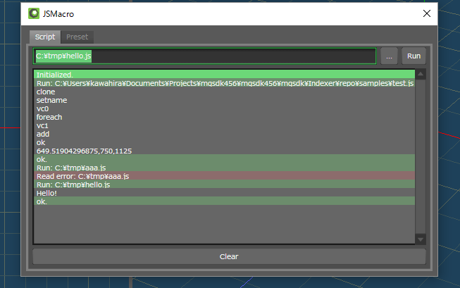

# JavaScriptでメタセコイアのマクロを書くプラグイン

JavaScriptでメタセコイアのマクロを書けるようにするプラグインです．

実験的なプラグインなので，特に理由が無い限り標準のPythonスクリプトを使って下さい．


## ダウンロード＆インストール

[`JSMacro.zip`](https://github.com/binzume/mqo-jsmacro-plugin/releases/latest) を展開し，
`Plugins/Station` ディレクトリに `JSMacro.dll` と `JSMacro.dll.core.js` を配置して下さい．

zipに含まれるDLLは**64bit版**です．(32ビット版は余裕があったら用意するかもしれませんが，どうしても必要な場合はソースからビルドして下さい...)

## 利用方法

「パネル」→「JS Macro」でウインドウが出ます．jsファイルを指定して実行できます．



- `...` ファイル選択ダイアログを開く
- `Run` 実行

ファイル名の入力欄に `js:`から始まる文字列を入れて実行すると入力内容が実行されます `js:console.log("hello")` ．
最後に実行したスクリプトの変数などにアクセスできます(デバッグ用)．

`Preset`タブでスクリプトを5個まで登録できます．プラグインのサブコマンドとしてショートカットキーの割当が可能です．

## API

メタセコイアのプラグインから呼べる機能をJavaScriptから扱いやすいようにラップしてあります．
個々の関数の動作はメタセコイアSDKのドキュメントを参照してください．


#### 注意点

- なるべく通常のArrayと同じように扱えるようにしていますが，push()/pop()などは動作しません．
- 配列はundefinedの要素が存在する場合(削除操作の後など)があります．連続した配列にしたい場合は `compact()` メソッドを呼んでください．

### MQDocument

グローバルに`document`として宣言されています．

- document.objects.length オブジェクト数(ReadOnly)
- document.objects[index] MQObjectを取得
- document.objects.append(obj) オブジェクトを追加
- document.objects.remove(obj) オブジェクトを削除
- document.materials.length マテリアル数(ReadOnly)
- document.materials[index] MQMaterialを取得
- document.materials.append(mat) マテリアルを追加
- document.materials.remove(mat) マテリアルを削除
- document.scene シーンを取得
- document.compact()
- document.clearSelect()
- document.isVertexSelected(objIndex, vertIndex)
- document.setVertexSelected(objIndex, vertIndex, bool)
- document.isFaceSelected(objIndex, faceIndex)
- document.setFaceSelected(objIndex, faceIndex, bool)

### MQObject

- object.id オブジェクト内でユニークなID
- object.name オブジェクト名
- object.clone() 複製したオブジェクトを返します(trueを渡すとドキュメントに登録された状態で複製されます)
- object.compact() 使われていない要素を切り詰めます
- object.merge(srcObj) srcObjをobjectにマージします
- object.freeze(flag) 曲面・鏡面をフリーズします(flag省略時は全て)
- object.verts.length (ReadOnly)
- object.verts[index]
- object.verts[index].refs (ReadOnly)
- object.verts.append(x,y,z) or append({x:X, y:Y, z:Z})
- object.faces.length (ReadOnly)
- object.faces[index]
- object.faces[index].invert()
- object.faces[index].points
- object.faces[index].material
- object.faces.append([1,2,3,4], mat_index)
- object.selected
- object.visible
- object.transform(matrix_or_fun) オブジェクトの全頂点座標を変換します

新しくオブジェクトを生成する場合は`new MQObject()` で作成し， append関数でドキュメントに追加して下さい．
コンストラクタの引数を省略した場合は，自動的に衝突しない名前が設定されます．

例：

```js
var square = new MQObject("square1");
square.verts.append(0, 0, 0);
square.verts.append(1, 0, 0);
square.verts.append(1, 1, 0);
square.verts.append(0, 1, 0);
square.faces.append([0, 1, 2, 3]);
document.objects.append(square);
```

#### MQObject.verts

- `verts[index]` は `{x:0,y:1,z:2}` 形式の値を返します
- `verts[0] = {x:0,y:1,z:2}` は動作しますが `verts[0].x = 0` は変更が反映されません(faceやcolorなども同様)
- 頂点の削除は `delete verts[index];`

### MQMaterial

- material.id オブジェクト内でユニークなID
- material.name マテリアル名
- material.color 色

今のところ一部の要素にしかアクセスできません．

新しくマテリアルを生成する場合は`new MQMaterial()` で作成し， append関数でドキュメントに追加して下さい．
コンストラクタの引数を省略した場合は，自動的に衝突しない名前が設定されます．

例：

```js
var red = new MQMaterial("red1");
red.color = {r:1.0, g:0.0, b:0.0};
var redIndex = document.materials.append(red);
```

#### MQMaterial.color

内容は `{r: red, g: green, b: blue, a: alpha}`.

アルファの値も一緒に返ります．設定する場合はアルファは省略可能です．

### MQScene

カメラ位置のみアクセスできます．

- document.scene.cameraPosition → `{x: X, y: Y, z: Z}`
- document.scene.cameraLookAt → `{x: X, y: Y, z: Z}`
- document.scene.cameraAngle → `{bank: B, head: H, pitch: Z}`


### MQMatrix

C++用のSDKに含まれるMQMatrixとは別物です． core.jsに実装されています．

`MQObject.transform()`に渡すことでオブジェクトの全頂点を簡単に変換できます．

例：

```js
document.objects[0].transform(MQMatrix.rotateMatrix(1,0,0, 15));
```

### その他

- console.log("message") メッセージをログに出力
- setInterval(), setTimeout() タイマー(暫定仕様なので利用は非推奨)
- process.load(scriptPath) 別スクリプトの読み込み＆実行(暫定仕様なので利用は非推奨)

カメラを回す例： (別のスクリプトを実行するまで停止しません)

```js
setInterval(() => {
	var originalLookAt = document.scene.cameraLookAt;
	document.scene.cameraPosition = MQMatrix.rotateMatrix(0,1,0, 1).transformV(document.scene.cameraPosition);
	document.scene.cameraLookAt = originalLookAt;
}, 10);
```

## TODO

- スクリプトからアクセス出来る属性を増やす
- メニュー操作自動化

